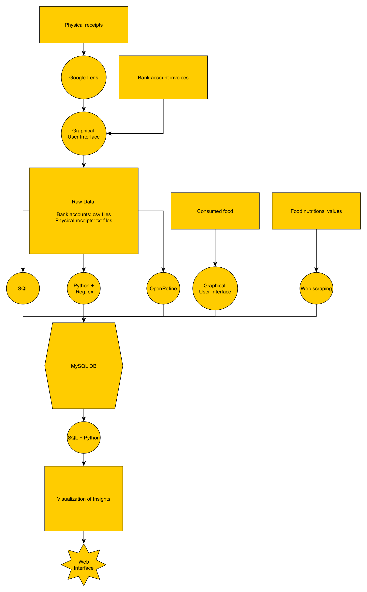
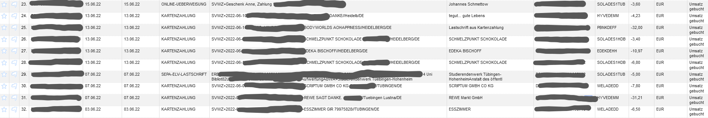
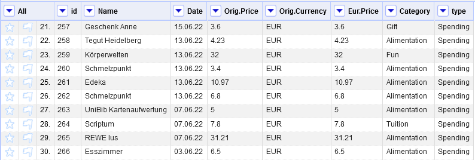
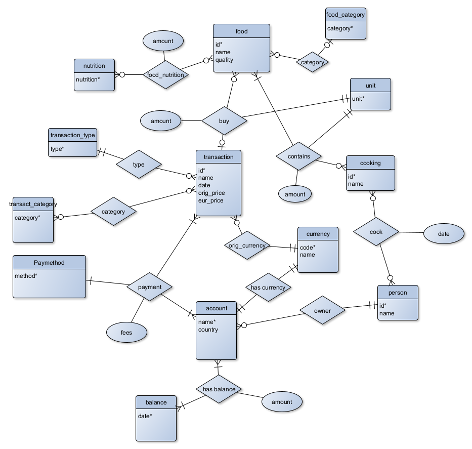

# Financial & Health Tracker Idea

Data science project aimed at helping you keep track of your spendings and alimentation habits, with the option for budgeting and making meal plans.

## GENERAL INTUITION
In the final form of the project, a client would use the product to do the following:

* automate keeping track of physical receipts for groceries

* enable meal tracking

* bring all income and spending sources (Bank accounts, Cash, Cards)  together to provide a helpful overview on financial situation

* provide useful visualizations and eating/spending plans

* link eating habits with spending plans

## Visualizing the Data Pipeline

This pipeline illustrates each different data step needed. 

## Detailed Description of the Plan

Short table of contents:

#### 1. Bank account invoice data acquisition (FINISHED)

This information can be manually obtained from each different bank and then fed into step 3.

#### 2. Physical receipt digitalization (TODO)

The user will be able to read his/her receipts to the app using similar technology to Google Lens. Of course, for private uses Google Lens is enough.

#### 3. Dealing with raw spending data (WIP)

This part was manually done in OpenRefine. An automated process using regular expressions has to be done for more efficient processing. The following images are a preview of the data cleaning process:

Figure 1. Raw data right after import

Figure 2. Processed Data according to the ER model of the Database

#### 4. Keeping track of consumed food (TODO)

The user will be able to input to the app the types of food he ate, with their respective quantity and time of eating

#### 5. Obtaining nutritional values for consumed food (TODO)

This can be done by scraping the Internet for food items from different Producers and their respective nutritional values.

#### 6. Linking up spendings with consumed food (FINISHED)

This will be made possible via relational databases. The following illustration represents the entity relationship structure of the MySQL DB which enables linking up financial and alimentation information

Notice how the structure of the DB supports multiple persons, multiple currencies (with approximative exchange rates) and more

#### 7. Accesing Database Data with Python (TODO)

A data pipeline needs to read the MySQL Database into a Python analysis file

#### 8. Analyzing data (TODO)

Following analyses are to be done:

- Time series analysis (example question: on which days am I going grocery shopping? Is it better if I only go once a week / more times a week in order to not give out as much money?)
- Linear optimisation (example question: what products to buy and eat in order to reach a 100g vegan protein goal daily with the lowest EURO price)
- Other questions:  To what shop should I go based on my shopping habits? How much variance have my spendings based on category and where can I save money the easiest?

#### 9. Visualization and presentation on Web interface (TODO)

All the information should be easily accessible via an app or a website.
